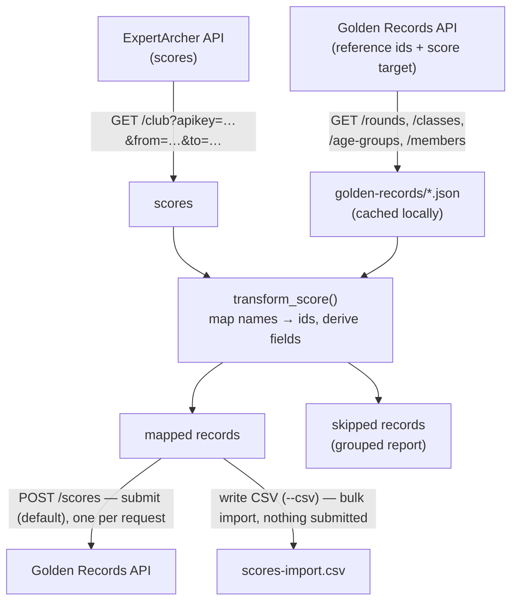

# ExpertArcher → Golden Records

A small Python tool that reads a club's scores from the **ExpertArcher** API,
maps each one onto the record shape the **Golden Records** Scores API expects,
and — by default — submits the mapped scores to Golden Records. It can instead
write them to a **CSV bulk-import file** (`--csv`, best for large historical
imports), or just fetch, map and report (`--dry-run`). Scores that can't be
mapped are skipped and explained in a readable report, so the underlying data
can be fixed at source.

It is intentionally a single, readable script ([app.py](app.py)) rather than a
framework — the goal is to make the integration easy to follow.

## How it works



The pipeline lives in `main()`:

1. **Fetch reference data from Golden Records** (`fetch_resource`) into the
   [golden-records/](golden-records/) directory, unless the files are already
   present. These provide the ids we map names onto. Re-download with `--refresh`.
2. **Fetch the scores from ExpertArcher** (`fetch_scores`) for the `--from` /
   `--to` window, optionally filtered by archer name (`--include-name` /
   `--exclude-name`).
3. **Map each score** to a Golden Records record (`transform_score`), resolving
   round / bow-type / member / age-group names to ids (`resolve`).
4. **Report** what mapped and what was skipped, and why (`print_report`).
5. **Submit** the mapped records to Golden Records (`submit_records`), unless
   `--dry-run` was given — or, with `--csv PATH`, write them to a bulk-import
   file instead of submitting (see [Bulk import via CSV](#bulk-import-via-csv)).
6. **Report the submission outcome** (`report_submission`): accepted /
   duplicate / error counts, errors grouped by type, with full per-record
   detail written to the error log. See [Submission results](#submission-results).

**Runs submit by default.** After reporting, the mapped records are POSTed to the
Golden Records Scores API, so run the tool deliberately. Pass `--dry-run` to
fetch, map and report without sending anything, or `--csv PATH` to write a
bulk-import file instead of submitting. See [Submitting scores](#submitting-scores)
and [Bulk import via CSV](#bulk-import-via-csv).

## The two APIs

| | ExpertArcher (source) | Golden Records (reference + target) |
|---|---|---|
| Used for | The scores to process | Ids for rounds, bow classes, age groups, members — **and** receiving the mapped scores |
| Read | `GET {base_url}/club` | `GET {base_url}/rounds`, `/classes`, `/age-groups`, `/members` |
| Write | — | `POST {base_url}/scores` (one mapped record per request; see [Submitting scores](#submitting-scores)) |
| Auth | API key as a **query-string** param (`apikey=…`) | API key as `Authorization: Basic <key>` header, **or** HTTP Basic Auth |
| Paging | Single request (date range bounds the result) | Reads are paged; last page detected via the `paging-headers` response header, falling back to a short final page when that header is absent |
| Config | `[expertarcher]` in [config.toml](config.toml) | `[api]` in [config.toml](config.toml) |

### Authentication notes for Golden Records

Golden Records supports two schemes (`_build_auth`), API key first:

- **API key (recommended)** — sent as `Authorization: Basic <key>`, i.e. the key
  replaces the usual base64 `username:password` value. A **club-level key returns
  the whole membership**.
- **HTTP Basic Auth (fallback)** — `username` / `password`. Note: under Basic
  Auth the `/members` endpoint returns **only the authenticating user's own
  record**, not the club roster. This is why the API key is strongly preferred.

Both APIs are rate-limited by a single shared `RateLimiter` (Golden Records
throttles to 1/second, 20/minute, 200/hour) and retried with exponential
backoff, honouring any `Retry-After` header (`_request_with_retry`, shared by
the GET fetches and the POST submissions).

## Field mapping

Each ExpertArcher score becomes one Golden Records record in `transform_score`.
The keys below are exactly what the Golden Records Scores API expects.

| Golden Records field | Source | Notes |
|---|---|---|
| `member_id` | member name → id | Name resolved against `members.json` |
| `round_id` | `round` name → id | Via mappings + `rounds.json` (see [Name resolution](#name-resolution)) |
| `class_id` | `bowtype` name → id | Via mappings + `bowtypes.json` |
| `age_group_id` | `gender` + `class` → id | e.g. `female` + `u14` → "Women U14" → id (`get_age_group`) |
| `date_shot` | `date` | ExpertArcher datetime reduced to ISO `YYYY-MM-DD` |
| `score`, `hits`, `golds` | same | Parsed as integers |
| `Xs` | `xs` / `Xs` | Either casing accepted; missing = 0 |
| `location` | `place` | Free text; trimmed, and empty when `place` is absent |
| `status` | `tournament` / `competition` flags | `ScoreStatusOptions` enum int: `4` Open Competition / `3` Club Competition / `2` Club Event |
| `record_status` | `tournament` | `True` only for open tournaments |
| `qualifying` | `round` name | `False` for "252" award rounds |
| `record_qualifying` | — | Always `True` (eligible for club records) |
| `user_1` | — | Constant `Expert Archer` on every record, tagging the ExpertArcher integration as the source |

### Name resolution

ExpertArcher and Golden Records mostly use the same names for rounds and bow
types, but not always. `resolve` handles this in two steps:

1. **Translate** the ExpertArcher name via the `[names]` table in
   [mappings.toml](mappings.toml) — `"ExpertArcher name" = "Golden Records name"`.
   Only names that differ by more than capitalisation are listed; anything not
   in the file is used as-is.
2. **Look up** the resulting name in the Golden Records id table
   (`rounds.json` / `bowtypes.json`), **case-insensitively**.

So `"afb"` needs a mapping (→ "American Flatbow"), but `"recurve"` does not
(matches "Recurve" by case-insensitive lookup). This keeps the hand-maintained
mappings file as small as possible. Unmatched names are reported, not guessed.

[mappings.toml](mappings.toml) also has a `[classifications]` table used only
by the CSV import, translating ExpertArcher classifications (e.g. `IB1`,
`Bowman 2nd class`) to the Golden Records classification name — see
[Bulk import via CSV](#bulk-import-via-csv).

## Setup

Requires Python ≥ 3.11 and [uv](https://docs.astral.sh/uv/).

```bash
uv sync                 # install dependencies (requests, python-dotenv)
cp .env.example .env     # then edit .env with your API keys
```

Edit [config.toml](config.toml) to set your ExpertArcher `base_url` and `club`
(the Golden Records `[api]` section is pre-filled). **`config.toml` holds no
secrets** — all API keys live in `.env`, which is gitignored.

`.env` keys (see [.env.example](.env.example)):

| Variable | For | Notes |
|---|---|---|
| `EXPERTARCHER_API_KEY` | ExpertArcher | Required |
| `GOLDEN_RECORDS_API_KEY` | Golden Records | Recommended |
| `GOLDEN_RECORDS_USERNAME` / `GOLDEN_RECORDS_PASSWORD` | Golden Records | Basic Auth fallback |

## Usage

```bash
# Process AND submit scores shot in July 2026 (see the warning below)
uv run python app.py --from 2026-07-01 --to 2026-08-01

# Same, but fetch/map/report only -- nothing is submitted
uv run python app.py --dry-run --from 2026-07-01 --to 2026-08-01

# Re-download the Golden Records reference files first
uv run python app.py --refresh --from 2026-07-01 --to 2026-08-01

# Write a CSV bulk-import file instead of submitting (best for large imports)
uv run python app.py --csv scores-import.csv --from 2026-07-01 --to 2026-08-01

# Only one archer (exact name match) -- or everyone except one
uv run python app.py --include-name "Fred Jones" --from 2026-07-01 --to 2026-08-01
uv run python app.py --exclude-name "Fred Jones" --from 2026-07-01 --to 2026-08-01

uv run python app.py --help    # all options
```

`--include-name NAME` processes only scores whose ExpertArcher name matches
`NAME` exactly; `--exclude-name NAME` processes everyone except that archer.
The two are mutually exclusive, matching is exact (case-sensitive), and the
filter is applied to the fetched scores before mapping — so it works the same
whether you submit or write a CSV.

> Runs submit to Golden Records by default; use `--dry-run` to skip it, or
> `--csv PATH` to write a bulk-import file instead — see
> [Submitting scores](#submitting-scores) and
> [Bulk import via CSV](#bulk-import-via-csv).

Beyond these, the reference-file locations (`--members`, `--age-groups`,
`--rounds`, `--bowtypes`), the `--mappings` and `--config` paths, the
`--error-log` path and `-v` / `--verbose` are all overridable — run
`app.py --help` for the full list.

### The report

```
============================================================
ExpertArcher -> Golden Records: processing report
============================================================
Records read:    409
Records parsed:  358
Records skipped: 51

SKIPPED RECORDS BY REASON
============================================================

Unmatched round  (8 unique)
===========================
    - '(252 40yrds barebow)' | Hugh Simpson  (6 record(s))
    ...
```

Skips are grouped by reason and collapsed to unique entries (member-name issues
by name; everything else by detail + archer), so each problem shows once with a
record count. Skip categories:

- **Unmatched round / bow type** — name unknown to both the mappings and Golden
  Records → add a mapping in [mappings.toml](mappings.toml) or fix it in
  ExpertArcher.
- **Unknown Golden Records round / bow type** — a mapping exists but points at a
  name Golden Records doesn't recognise → the mapping is wrong.
- **Unmatched member name** — the archer name isn't in the Golden Records roster
  (typo, missing surname, etc.).
- **Unmatched age group** — the gender/class combination didn't resolve.
- **Invalid number / date** — a required field was missing or unparseable.

## Submitting scores

> ⚠️ **Runs write live data to Golden Records by default and this cannot be
> undone from the tool.** Run it only when you mean to submit. To fetch, map and
> report without sending anything, pass `--dry-run`.

After printing the report, the tool POSTs each mapped record to the Golden
Records Scores API (`POST {base_url}/scores`, one record per request):

```bash
uv run python app.py --from 2026-07-01 --to 2026-08-01

# Dry run: everything except the POST
uv run python app.py --dry-run --from 2026-07-01 --to 2026-08-01
```

With `--dry-run` the tool reports how many records *would* be submitted and
sends nothing. Otherwise each mapped record is POSTed individually, spaced by the
same rate limiter and retried on 429/5xx like the reference fetches. Submission
continues past any records the API rejects, so one bad record does not block the
rest. Skipped records (from the report) are never submitted.

### Submission results

After submitting, the tool prints a summary rather than one line per record:

```
Submitted 12 of 15 record(s).
Duplicates skipped (already in Golden Records): 2
Rejected with errors: 1

SUBMISSION ERRORS BY TYPE
============================================================
    - No valid entry in Date Shot field.  (1)

Full detail of the 3 rejected record(s) written to submission-errors.log
```

- **Duplicates** — the API rejects a score it already holds with the message
  `This score already exists in the database.` This is benign (expected when you
  re-run a submission), so it is counted on its own line, separate from real
  errors.
- **Errors by type** — every other rejection is counted by the API's own error
  message, so systematic problems (e.g. a bad field) stand out at a glance.
- **`submission-errors.log`** — the full detail of every rejected record (the
  response body and the record that was sent) is appended here for separate
  review, instead of flooding the report. The file is gitignored; change its
  path with `--error-log`. `--verbose` still logs every request live.

## Bulk import via CSV

The per-record API path suits ongoing, incremental submission of a handful of
scores. For a **large historical import**, Golden Records' throttle bites: it
allows only **200 requests/hour**, so 300+ scores (one POST each) would take
well over an hour and lean heavily on retries. Golden Records also accepts a
**CSV bulk-import file** — one upload, no per-record throttle — which is the
better route for a backfill.

`--csv PATH` runs the same fetch → map → report pipeline (so unmapped scores
are skipped and explained exactly as normal), then writes the mapped records to
`PATH` in Golden Records' import format and **submits nothing** (no POST is
made). You then upload the file through the Golden Records web import.

```bash
uv run python app.py --csv scores-import.csv --from 2017-01-01 --to 2018-12-31
```

The CSV format differs from the JSON API body — it matches Golden Records'
sample `score-records.csv`:

| CSV column | Source | Notes |
|---|---|---|
| `Date` | `date` | `DD/MM/YYYY` (the API uses ISO instead) |
| `Name` | member name | The name itself, not the id |
| `Score` / `Hits` / `Golds` / `Xs` | same | Integers |
| `Handicap` | `handicap` | From ExpertArcher when in the `select` (see [config.toml](config.toml)); blank otherwise |
| `Classification` | `classification` | Translated to the Golden Records name via the `[classifications]` table in [mappings.toml](mappings.toml) (e.g. `IB1` → `Indoor Bowman 1st Class`); an unmapped value is left blank |
| `Location` | `place` | Trimmed free text |
| `Class` | `bowtype` name | The resolved Golden Records **bow type** name |
| `Age Group` | `gender` + `class` | e.g. `Men`, `Women`, `Men U16` |
| `Round` | `round` name | The resolved Golden Records round name |
| `Type` | round | `Indoor` / `Outdoor`, from the round's `type` in `rounds.json` |
| `Record Status` / `Qualifying` | derived | `TRUE` / `FALSE` (uppercase) |
| `Status` | `tournament` / `competition` flags | Text label: `Open Competition` / `Club Competition` / `Club Event` (the same mapping the API sends as an enum int) |
| `Affiliation` / `Affiliation Expiry` / `Affiliation ID` / `Verified` | — | Left blank |

The file ends with a single `END` sentinel row, as the importer expects.

> ⚠️ A generated CSV contains **member names** (personal data), so it is
> gitignored (the `*-import.csv` pattern) — keep it out of source control, like
> `members.json`. The committed `score-records.csv` is Golden Records' own
> sample, with fake names.

## Project layout

```
app.py                 The whole tool (fetch → map → report → submit / CSV)
config.toml            API config for both services (no secrets; committed)
.env.example           Template for the API keys → copy to .env (gitignored)
mappings.toml          ExpertArcher → Golden Records name overrides
golden-records/        Cached reference data downloaded from Golden Records
  rounds.json, bowtypes.json, age-groups.json   (committed)
  members.json                                  (gitignored — personal data)
score-records.csv      Golden Records' sample CSV import file (fake data; committed)
*-import.csv           Generated CSV import files (gitignored — contain member names)
submission-errors.log  Full detail of rejected submissions (gitignored; per run)
pyproject.toml         Dependencies / uv project
```

## Notes on data & privacy

- `golden-records/members.json` contains personal data and is **gitignored**; it
  is downloaded fresh from the API and never committed.
- Generated CSV import files (`*-import.csv`) contain member names and are
  **gitignored** for the same reason; the committed `score-records.csv` is
  Golden Records' fake-data sample.
- Scores are fetched live from ExpertArcher and not stored locally.
- API keys are read from the environment only, never committed.
